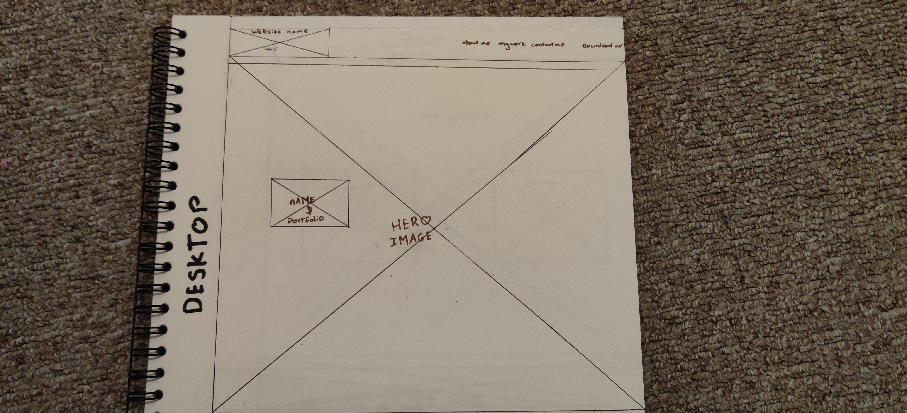
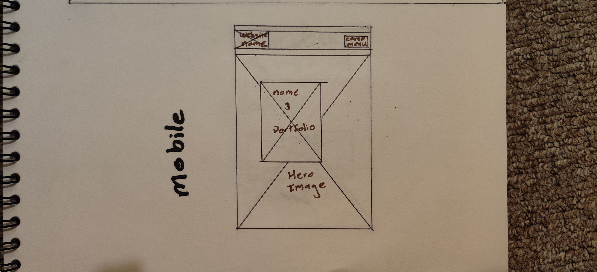
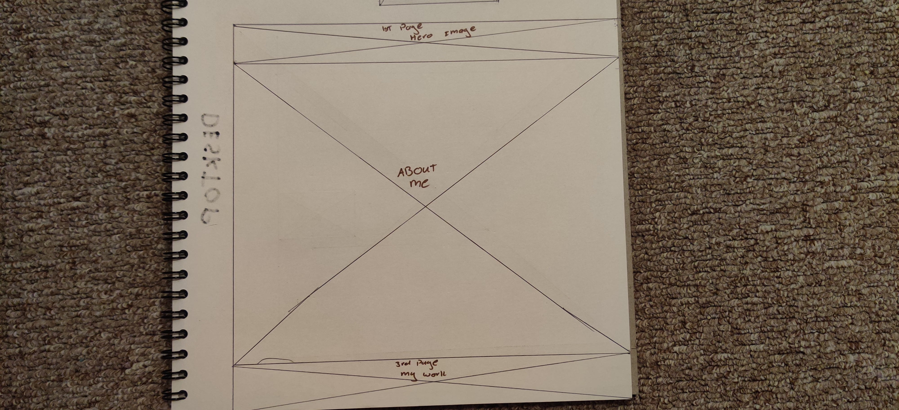
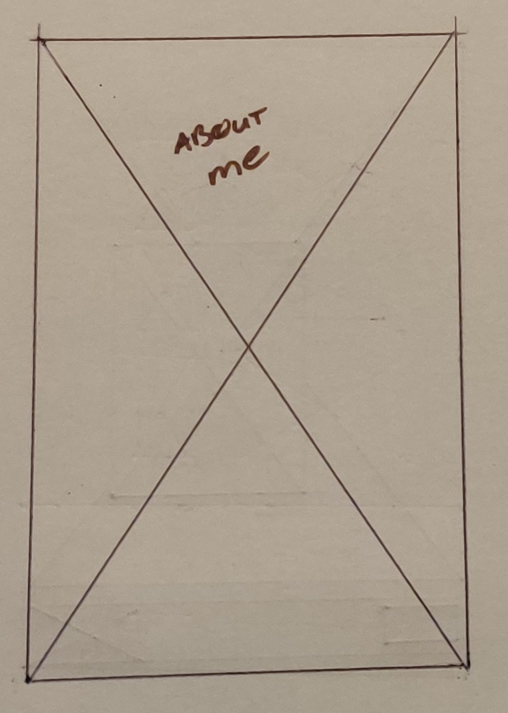
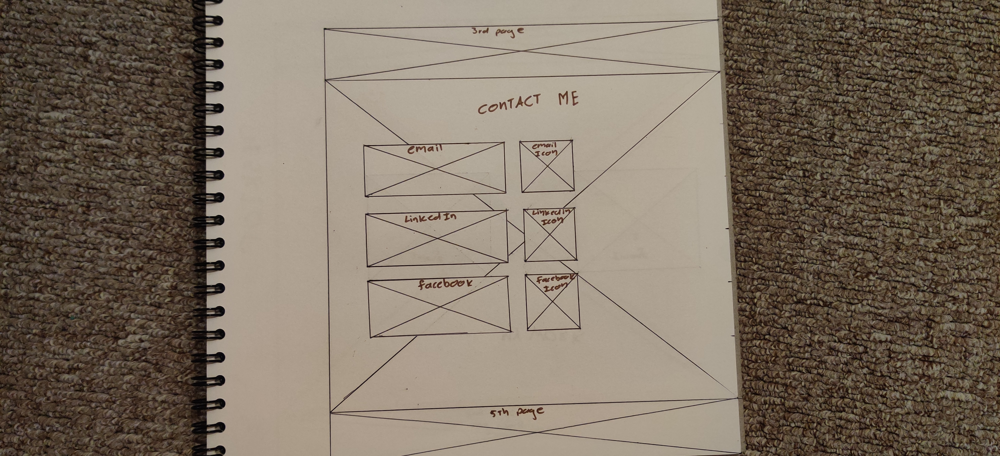
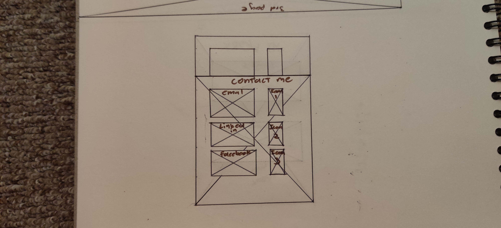
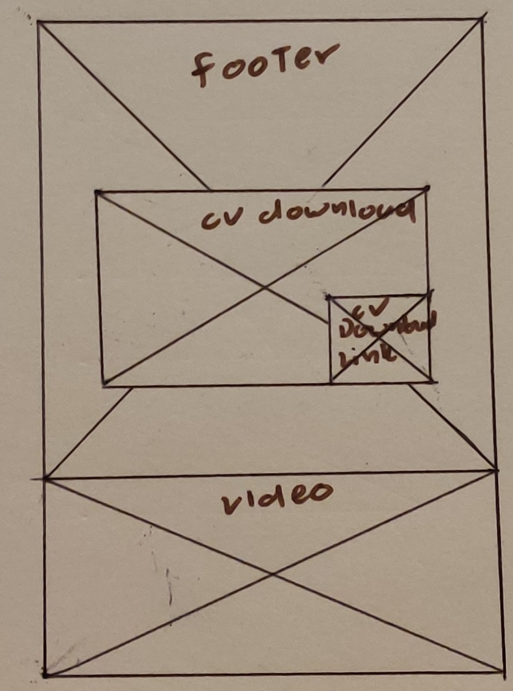
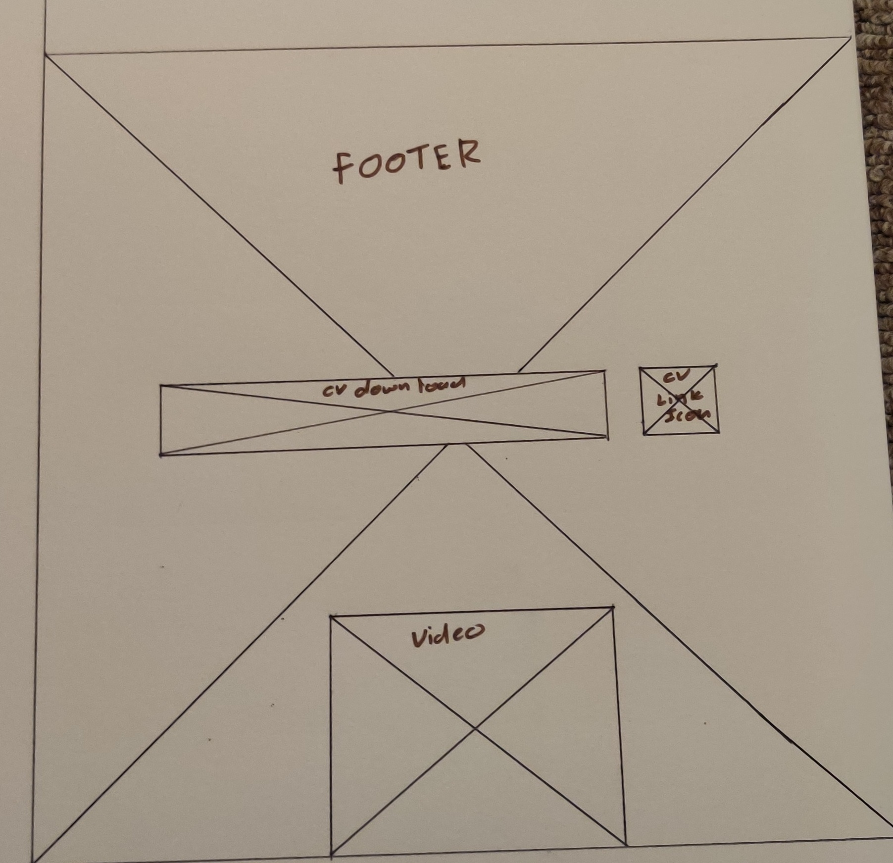

# Milestone Project 1
## Reason For Site
This Website was created for the  purposes of completing the first Milestone Project for Code Institute's Full Stack Development course as well as to show off all of my skills and achievements.
It was built using the knowledge learned from the HTML, CSS and the User Centric Design module

*** 
# User Experience

## User stories

### Goals for First Time Visitors

* As a User For The First Time, I want to easily understand the main purpose of the site
* As a User For The First Time, I want to view the website clearly on my mobile device.
* As a User For The First Time, I want to be able to  navigate easily through the site to find content.

### Goals for Returning Visitors

* As a Returning user, I want to see any updates or new projects listed .
* As a Returning user, I want to contact the person easily if need be.

### Goals for Frequent Visitors

* As a Frequent user, I want to check to see if there are any updates to the canidates portfolio.
* As a Frequent user, I want to be able to contact the individual if need be.
* As a Frequent user, I want to check to see if there are any new work experiences added.

## Structure
There is a Navigation menu at the top of the page that directs people to the relevant section
The Nav Menu will be collapsed  on a Mobile device to make use of space on smaller devices.
The purpose of this is to achieve the below goal:
> * As a User For The First Time, I want to be able to  navigate easily through the site to find content.

The main page will clearly state who the individual is with their relevenat experiance below.
The purpose of this is to achieve the below goal:
> As a User For The First Time, I want to easily understand the main purpose of the site

All pages will be responsive and the layouts will change depending on screen size.
Images are displayed properly and will shrink accordinly 
The purpose of this is to achieve the below goal:
> As a User For The First Time, I want to view the website clearly on my mobile device.

There is a section to contact this specific individual which will allow any persons or organisations to easily contact the appropriate person.
The purpose of this is to achieve the below goal:
> As a Returning user, I want to contact the person easily if need be.
As a Frequent user, I want to be able to contact the individual if need be.  

## Wireframes
Hero 
 
Hero Mobile  
 
About Page 
 
About Page mobile 
 
My Work 
 
My Work Mobile 
 
Contact Me 
 
Contact Me Mobile 
 
Footer 
 
Footer 
 

***

## Technologies implemented

* HTML
	* This project uses HTML as the main language used to complete the structure of the Website.
* CSS
	* This project uses custom written CSS to style the Website.
* [Bootstrap]
	* The Bootstrap framework is used throughout this website for layouts and styling. The car
	* This has also been used to import JavaScript/Query used for the pop up Event booking modal
* [Font Awesome]
	* Font awesome Icons are used for the Social media links contained in the Footer section of the website.
* [Google Fonts]
	* Google fonts are used throughout the project to import the *Libre Baskerville* and *Cabin* fonts.
* [GitHub]
	* GithHub is the hosting site used to store the source code for the Website and [Git Pages](https://pages.github.com/) is used for the deployment of the live site.
* [Git]
	* Git is used as version control software to commit and push code to the GitHub repository where the source code is stored.
* [FireFox Developer Tools]
	* Firefox's built in developer tools are used to inspect page elements and help debug issues with the site layout and test different CSS styles.
***
## Testing

### Test Results

Please note these results are a .xlsx file and will require excel, google docs or compatiable program to open the file. 
All Pages were run through the [W3C HTML Validator]and showed no errors. 
CSS Stylesheet was run through the [W3C CSS Validator] and showed no errors. 

Test 01 - Test responsiveness of website on various screen sizes on Firefox. Website's responsive, no images are distorted and all elements are within the correct sizes 
Test 02 - Test responsiveness of website on various screen sizes on Safari.  Website's responsive, no images are distorted and all elements are within the correct sizes 
Test 03 - Test responsiveness of website on various screen sizes on Chrome.  Website's responsive, no images are distorted and all elements are within the correct sizes 
Test 04 - Test the relevante links (such as download CV and contact me links) on 3 different browsers  (Chrome, Safari & Firefox) - All clickable links work and produce the allocated outcome.
Test 05 - Hover elemnt changes color on hover - On hover the appropriate element will change colour
Test 06 - Website implementation vs Actual implementation - Although the original goal was to have all pages as their own page the flow was better on a 1 paged different section website.

### Issues and Resolutions to issues found during testing
Issue 1 - Navigation menu wouldn't shrink to smaller screens - Using bootstrap to create 1 nav menu instead of 2 different ones for screensizes made it easy so solve this issue.
Issue 2 - Pop up wouldn't scale with screen size - Gave it a variable sizes rather than fixed to allow for scaling 
Issue 3 - Clicking on portflio button was not going to correct place on page - fixed by assigning it a location to go to 
Issue 4 - Download link no working - fixed for somereason was not allowing the download.

***
## Deployment

* git add filename - This command was used to add fils to the staging area before commiting.
* git commit -m  - This command was used to commit changes to the local repository.
* git push - This command is used to push all commited changes to the GitHub. 

***
## Credits

### Media
The photos and videos are all copy right free assets found from various websites 

### Acknowledgements

I'd like to thank my mentor Spencer Baribell for his guidance throughout my project. 